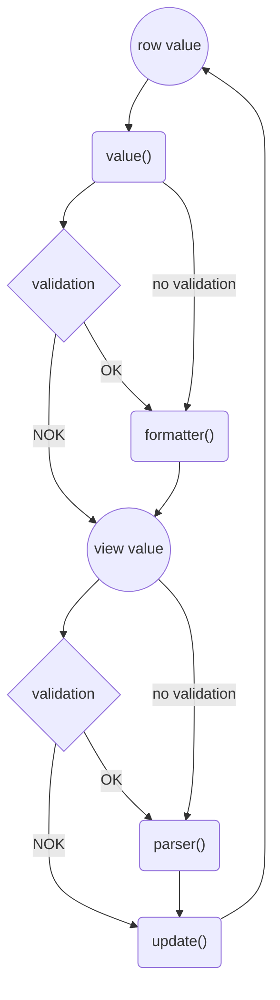
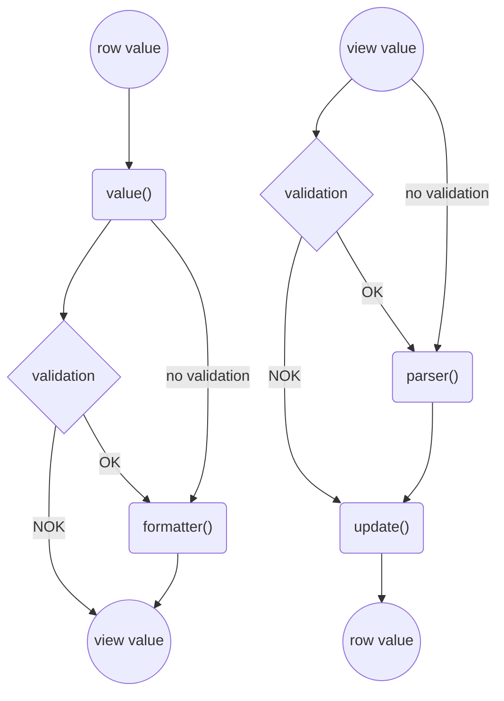

Använd kolumntypen textfält (`text`) för inmatning och visning av textbaserat innehåll i tabellen.

Det är den mest flexibla kolumntypen och den fungerar både för enkel fritext och de specialiserade textfälten med inbyggd validering, formatering och parsning.

I det enklaste fallet kopplar du kolumnen till en egenskap i raden med `key`.

```ts
import { defineTableColumns } from "@fkui/vue-labs";

interface Row {
    fruit: string;
}

const columns = defineTableColumns<Row>([
    {
        type: "text",
        header: "Frukt",
        key: "fruit",
    },
]);
```

Om cellen ska vara redigerbar sätter du `editable: true` och uppdaterar raden via `key` eller `update()`.

```ts
import { defineTableColumns } from "@fkui/vue-labs";

interface Row {
    fruit: string;
}

const columns = defineTableColumns<Row>([
    {
        type: "text",
        header: "Frukt",
        key: "fruit",
        editable: true,
    },
]);
```

## Läsa värde med `value`

Använd `value(row)` när värdet ska räknas fram från flera fält eller när du inte vill läsa direkt från `key`.

```ts
import { defineTableColumns } from "@fkui/vue-labs";

interface Row {
    firstName: string;
    lastName: string;
}

const columns = defineTableColumns<Row>([
    {
        type: "text",
        header: "Namn",
        value(row) {
            return `${row.firstName} ${row.lastName}`;
        },
    },
]);
```

## Formatera värde med `formatter`

Använd `formatter(value)` när du vill ändra hur värdet visas i tabellen utan att ändra datan i raden.

```ts
import { defineTableColumns } from "@fkui/vue-labs";

interface Row {
    fruit: string;
}

const columns = defineTableColumns<Row>([
    {
        type: "text",
        header: "Frukt",
        key: "fruit",
        formatter(value) {
            return value.toUpperCase();
        },
    },
]);
```

## Bearbeta inmatning med `parser`

Om kolumnen är redigerbar kan du använda `parser(value)` för att normalisera användarens inmatning innan den skrivs tillbaka.

```ts
import { defineTableColumns } from "@fkui/vue-labs";

interface Row {
    fruit: string;
}

const columns = defineTableColumns<Row>([
    {
        type: "text",
        header: "Frukt",
        key: "fruit",
        editable: true,
        parser(value) {
            return value.trim();
        },
    },
]);
```

## Styra uppdatering med `update`

Använd `update(row, newValue, oldValue)` när du behöver full kontroll över hur raden ska ändras.

```ts
import { defineTableColumns } from "@fkui/vue-labs";

interface Row {
    fruit: string;
}

const columns = defineTableColumns<Row>([
    {
        type: "text",
        header: "Frukt",
        key: "fruit",
        editable: true,
        update(row, newValue) {
            row.fruit = newValue;
        },
    },
]);
```

## Validering

Textfält kan valideras med `validation`.
Det är användbart när cellen är redigerbar och du vill styra vilka värden som är tillåtna.

```ts
import { defineTableColumns } from "@fkui/vue-labs";

interface Row {
    fruit: string;
}

const columns = defineTableColumns<Row>([
    {
        type: "text",
        header: "Frukt",
        key: "fruit",
        editable: true,
        validation: {
            required: {},
            minLength: { length: 2 },
        },
    },
]);
```

## Specialiserade textfält

För vissa vanliga datatyper finns färdiga varianter av `text` med inbyggd formattering, parsning och validering.

- {@link column-type-bank-account-number kontonummer}
- {@link column-type-bankgiro bankgiro}
- {@link column-type-clearing-number clearingnummer}
- {@link column-type-date batum}
- {@link column-type-email mejladress}
- {@link column-type-number numeriskt}
- {@link column-type-organisationsnummer organisationsnummer}
- {@link column-type-personnummer personnummer}
- {@link column-type-plusgiro plusgiro}
- {@link column-type-postal-code postnummer}
- {@link column-type-percent procent}
- {@link column-type-phone-number telefonnummer}
- {@link column-type-currency valuta}

## Bra att veta

- `key` används när kolumnen ska läsa och skriva mot ett specifikt fält i raden.
- `label` används som skärmläsartext för redigerbara celler.
- `align` och `tnum` kan användas för att styra justering och tabular figures.
- `text:currency`, `text:number` och `text:percent` blir högerjusterade som standard.

## Flödesdiagram





## Parametrar

**`type:`** `InputTypeText` eller `InputTypeNumber`
: Kolumnens typ, till exempel `text`, `text:date`, `text:number`.

**`header:`** `string | Readonly<Ref<string>>`
: Kolumnrubrik som visas i thead.

**`key:`** `K` {@optional}
: Kopplar cellens värde till värde i `T`.

**`label:`** `(row: T): string => {}` {@optional}
: Skärmläsartext för redigerbar cell.

**`value:`** `(row: T): string => {}` {@optional}
: Läser eller beräknar visningsvärde.

**`formatter:`** `(value: string): string | undefined => {}` {@optional}
: Formaterar visningsvärde.

**`parser:`** `(value: string): string | undefined => {}` {@optional}
: Parsar redigerat värde före uppdatering.

**`update:`** `(row: T, newValue: string, oldValue: string): void => {}` {@optional}
: Egen uppdateringslogik.

**`editable:`** `boolean | ((row: T) => boolean)` {@optional}
: Om cellen är redigerbar.

**`validation:`** `ValidatorConfigs` {@optional}
: Konfiguration för validering.

**`align:`** `"left" | "right"` {@optional}
: Vänster- eller högerjustering.

**`tnum:`** `boolean` {@optional}
: Tabular figures.

**`attributes:`** `Record<string, string | number | boolean | undefined> | ((row: T) => Record<string, string | number | boolean | undefined>)` {@optional}
: Attribut för inmatningsfält.

**`description:`** `string | Readonly<Ref<string | null>>` {@optional}
: Formatbeskrivning.

**`size:`** `TableColumnSize | Readonly<Ref<TableColumnSize | null>>` {@optional}
: Hur kolumnens bredd skalas.

**`enabled:`** `boolean | Readonly<Ref<boolean>>` {@optional}
: Om kolumnen är aktiv.
