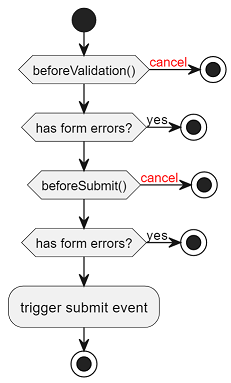

Du använder valideringsformulär när du har ett formulär eller ett mindre delformulär som ska valideras.
Vid tryck på submit-knapp utförs klientvalidering och de fel som hittas presenteras i en lista som får fokus.
Komponentens `submit`-event skickas enbart om allt innehåll är giltigt.

Komponenten är transparent och attribut tilldelas `form`-elementet.
Attributet `autocomplete` är satt till `off`.

```import
FValidationFormDefault.vue
```

## Formulär med få fält

Är det få fält som ingår i formuläret är det onödigt att visa en fellista.
Då finns ett alternativ att fokusera på första felaktiga fältet.

```diff
     <f-validation-form
         @submit="onSubmit"
+        :use-error-list="false"
     >
     </f-validation-form>
```

## Formulär med dolda fält

För att få validering och felhantering att fungera för inmatningskomponenter som ligger dolda i en kollapsad expanderbar yta måste du se till att ytan öppnas.
Använd `errorListBeforeNavigate` för att öppna den expanderbara ytan innan fokus kan flyttas till inmatningsfältet.

```diff
<template>
     <f-validation-form
+         :error-list-before-navigate="expandPanel"
     >
      <template #default>
        <f-expandable-panel :expanded="expand">
          <template #title>Panel to be expanded</template>
           <template #default>
            <f-text-field
              id="field1"
              v-model="field1"
              v-validation.required
            >
                Field1
            </f-text-field>
          </template>
        </f-expandable-panel>
     </f-validation-form>
</template>
```

Följande exempel visar hur man kan använda `errorListBeforeNavigate` för att expandera ytan innan fokus flyttas.

```import
WithErrorListAndCbFunction.vue
```

## Påverka flöde vid klick på submit

Fält valideras redan med vanlig validering, men om extra validering behövs (manuella steg, korsvalidering eller servervalidering osv) så kan `beforeValidation` eller `beforeSubmit` användas för att påverka flödet.



| Hook             | Beskrivning                                                                                                                     |
| ---------------- | ------------------------------------------------------------------------------------------------------------------------------- |
| beforeValidation | Anropas före ordinarie validering, använd denna om du vill använda dig av inmatade värden oavsett om de är validerade eller ej. |
| beforeSubmit     | Anropas efter ordinarie validering men före submit eventet emittas, använd denna om du vill använda dig av validerade värden.   |

Båda hooks kan avbryta flödet genom att returnera `FValidationFormAction.ABORT`:

```ts
import { FValidationFormAction } from "@fkui/vue";

declare function awesomeServerValidation(): Promise<string>;

/* --- cut above --- */

async function onBeforeSubmit(): Promise<FValidationFormAction | undefined> {
    const result = await awesomeServerValidation();
    if (result === "fail") {
        return FValidationFormAction.CANCEL;
    }
}
```

## Servervalidering

Följande exempel visar hur man kan använda `beforeSubmit` för att servervalidera inmatningsfält.
Första inmatningsfältet kommer alltid få ett fel när man försöker skicka in formuläret.

```import
FValidationFormServerError.vue
```

## API

:::api
vue:FValidationForm
:::
