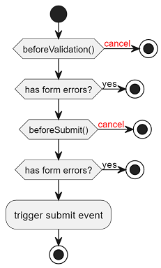

Du använder valideringsformulär när du har ett formulär eller ett mindre delformulär som ska valideras.
Vid tryck på submit-knapp utförs klientvalidering och de fel som hittas presenteras i en lista som får fokus.
Komponentens `submit`-event skickas enbart om allt innehåll är giltigt.

Komponenten är transparent och attribut tilldelas `form`-elementet.
Attributet `autocomplete` är satt till `off`.

```import
FValidationFormDefault.vue
```

## Formulär med få fält

Är det få fält som ingår i formuläret är det onödigt att visa en fellista.
Då finns ett alternativ att fokusera på första felaktiga fältet.

```diff
     <f-validation-form
         @submit="onSubmit"
+        :use-error-list="false"
     >
     </f-validation-form>
```

## Påverka flöde vid klick på submit

Fält valideras redan med vanlig validering, men om extra validering behövs (manuella steg, korsvalidering eller servervalidering osv) så kan `beforeValidation` eller `beforeSubmit` användas för att påverka flödet.



| Hook             | Beskrivning                                                                                                                     |
| ---------------- | ------------------------------------------------------------------------------------------------------------------------------- |
| beforeValidation | Anropas före ordinarie validering, använd denna om du vill använda dig av inmatade värden oavsett om de är validerade eller ej. |
| beforeSubmit     | Anropas efter ordinarie validering men före submit eventet emittas, använd denna om du vill använda dig av validerade värden.   |

Båda hooks kan avbryta flödet genom att returnera `FValidationFormAction.ABORT`:

```ts
@onBeforeSubmit() {
  const result = await this.awesomeServerValidation();
  if (result === 'fail') {
    return FValidationFormAction.CANCEL;
  }
}
```

## Servervalidering

Följande exempel visar hur man kan använda `beforeSubmit` för att servervalidera inmatningsfält.
Första inmatningsfältet kommer alltid få ett fel när man försöker skicka in formuläret.

```import
FValidationFormServerError.vue
```

## API

:::api
vue:FValidationForm
:::
