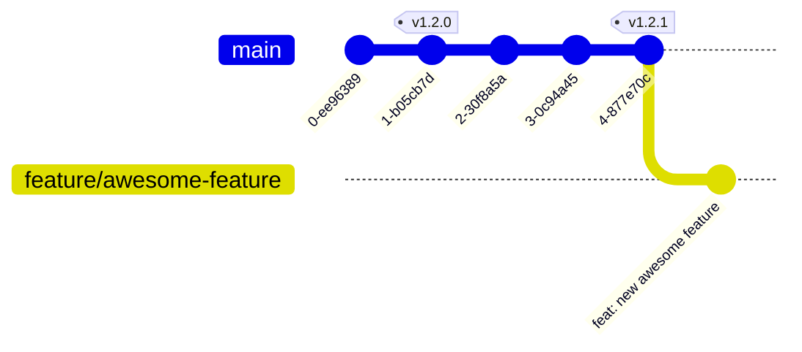

Här beskriver vi hur du går från en ide till en ny version av FKUI.


## Innan du börjar

Kontakta FKDS-teamet innan du påbörjar ditt arbeta så att du inte gör något i onödan.

På så vis kan vi säkerställa

- att ingen annan redan jobbar med samma feature
- att det är något vi vill lägga in i designsystemet (så ditt arbete inte blir bortkastat)
- att lösningsförslaget är genomtänkt och förankrat med krav, designers, copy, och så vidare.

För större ändringar utser vi en kontaktperson i FKDS-teamet som hjälper till med frågor och funderingar och lotsar dig genom releaseprocessen.

## Implementation

Efter att du kommunicerat med teamet och fått en kontaktperson kan du börja implementera.

Vi använder `main` som primär branch och du utgår vanligtvis från den branchen.
Gäller det en buggrättning som ska ut mot en äldre version utgår du från `release/N.x` (exempelvis `release/4.x` för v4).

### Branchnamn

Namnge din branch utifrån syfte:

- `feature/...` - en ny feature som läggs till.
- `bugfix/...` - buggrättning av existerande feature.

Om din branch enbart rör dokumentation eller refaktorisering kan du använda:

- `docs/...` - ändring av enbart dokumentation.
- `refactor/...` - enbart refaktorisering.

Om det finns ett JIRA- eller GitHub-ärende kan du använda det i branchens namn:

- `bugfix/SFKUI-1234-...` för JIRA-ärende.
- `feature/issue-123` - för GitHub-ärende.

### Commits

Commitmeddelanden skrivs i ett format baserat på [Conventional Commits][conventional-commits] och ligger som grund för release och changelog.

- Läs mer om {@link commits commitmeddelanden}.

[conventional-commits]: https://www.conventionalcommits.org/en/v1.0.0/

Vi rekommenderar följande arbetsflöde:

1. Skapa en branch som utgår från `main` eller `release/N.x`.
2. Skapa commits.
    - Varje distinkt/fristående ändring i en egen commit.
    - Använd `git commit --amend` för att ändra föregående commit.
    - Använd `git commit --fixup :/"search term"` för att ändra en äldre commit (där "search term" är en del av tidigare commitmeddelande).
    - Använd `refactor: ...` för ändringar relaterade till din feature som inte behöver synas ut mot konsument.


Städa upp din branch inför en Pull Request:

1. `git fetch` - för att hämta ner senaste från Github.
2. `git rebase origin/main` - för att flytta dina commits över senaste `main` (rebase).
3. `git rebase -i origin/main` - för att slå ihop, ändra ordning och dela upp commits (interactive rebase).



Läs igenom dina commits och tänk till för varje:

- Är det en distinkt ändring? Ska den delas eller slås ihop med andra commits?
- Är meddelandet begripligt utan mer sammanhang?
- Ska meddelandet visas i Changelog och announcements?

## Brytande ändringar

Undvik brytande ändringar om det är möjligt.
Skriv istället koden på ett sätt som fungerar bakåtkompatibelt.
Rådgör gärna med din kontaktperson i FKDS-teamet.

Exempel på åtgärder du kan göra för att behålla bakåtkompatibilitet:

- En ny komponent som ersätter en gammal som deprekeras.
- En ny prop som ersätter en gammal och/eller gammal prop som accepterar flera datatyper och värden där vissa är deprekerade.

Går det inte lösa utan att bryta kompatibilitet så gäller följande:

- Vi tillsammans samlar ihop flera brytande ändringar i samma release.
- Vi tillsammans går igenom kodbasen och tar nuvarande deprekerad funktionalitet.
- Vi tillsammans uppdaterar {@link release-plan Release planen}.
- Vi tillsammans arbetar fram ett nyhetsmeddelande.
- Din commit ska använda `!` efter type samt en trailer med `BREAKING CHANGE:` och kortfattade förklaring och instruktioner till migrering.
- Din commit ska innehålla en utförlig migreringsguide. Inkludera exempel och kod-diff.

Exempel på commitmeddelande:

```plaintext
feat!: replace X with Y (refs XYZ-123)

BREAKING CHANGE: the X feature has been replaced with Y. To migrate do this and
that. See migration guide for details.
```

Exempel på migreringsguide:

````md
Feature X är ersatt med Y.
Du behöver göra detta och detta.
Tänk på att.

```diff
-<f-component-x :foo="bar">
+<f-component-y :fred="barney">
```

Om du har detta måste du också göra detta:

```diff
-<f-component-x :foo="bar" something>
+<f-component-y :fred="barney" else>
```
````

## Pull request

En pull request ska generellt sett innehålla:

1. En tydlig beskrivning:
    - Vad är bakgrunden till ändringen? Beskriv ett användarfall eller hur en bugg uppstår.
    - Hur löser denna pull requesten ovan beskrivet problem?
    - Om ändringen är visuell inkludera gärna en enkel före/efter bild i beskrivningen.
2. Välskriven kod som följer de kodstandarer vi satt upp.
3. Testfall, läs mer om {@link testverktyg testning}:
    - Enhetstester för logik.
    - Komponenttester för interaktion.
    - Screenshot-tester för visuellt utseende.
4. Dokumentation:
    - Behöverer live-exempel uppdateras?
    - Behövs nytt stycke som förklarar vad ändringen är?
    - Behövs en guide som lär ut hur man använder ändringen?

När din branch är redo för granskning lägger du en pull request mot `main`.
Din branch bör vara rebased över `main` och bör löpande rebasas över `main`.

Vi accepterar merge commits men föredrar rebase för att hålla en ren historik.

Om du använder squash merge är det viktigt att ditt nya commitmeddelande korrekt reflekterar ändringen.
Ta bort övriga texter, behåll enbart det nya commitmeddelandet.

Innan merge förväntar vi oss att du läst igenom listan med commits och säkerställt att samtliga commits är lämpliga för changelog.
Några exempel på vanliga fel (men ej uteslutande lista):

- Flera commits med samma meddelande. Det medför brus i changelog där samma feature visas flera gånger (en gång per commit). Om commits hör ihop slå ihop dem till en och samma commit.
- Flera distinkta feature eller buggrättningar ligger inbakade i en och samma commit. Det medför att ändringar inte syns i changelog. Dela upp din commit i flera nya, en per distinkt ändring.
- Fel typ, exempelvis att `fix` eller `feat` används för ändringar som inte direkt påverkar konsumenten. Det medför brus i changelog där vi visar ändringar som inte påverkar. Använd en annan lämplig type exempelvis `refactor` eller `style`.

Vi har ingen hård regel för hur många som behöver godkänna din pull request men några tumregler:

- Om ändringen rör mer än trivial kod: minst en utvecklare ur FKDS-teamet ska ha granskat.
- Om ändringen rör mer än trivial dokumentation (stavfel, osv): minst en icke-utvecklare ur FKDS-teamet ska ha granskat.
- Om ändringen behöver testning (och vid kodändring ska du utgå från att det behövs): minst en testare från ditt team eller ur FKDS-teamet. Rådgör gärna med testare i FKDS-teamet om vad/hur ändringen ska testas.

Tumregler för godkännande av pull request:

- Vi använder uppgifter (tasks) för saker som måste korrigeras.
- Har du fått ett godkännande innebär det att personen anser att din PR är tillräckligt bra för merge även om det fortfarande finns kommentarer kvar från personen.

Om du har skrivrättigheter till repository kan du merga din pull request själv.
Be din kontaktperson merga om du saknar du rättigheter.

Om din ändring är stor eller komplex finns det en risk att granskning drar ut på tiden.
Försök att dela upp din PR i flera små PRs som kan granskas och mergas inviduellt.
Rådgör med kontaktpersonen i FKDS-teamet om hur granskningen ska slutföras och när det är lämpligt att merga.

Skapa gärna en pull request tidigt för att samla in återkoppling.
Du kan med fördel skapa den som en "Draft" för att tydligt markera att det inte är färdigt arbete.

Se också {@link checklist-publication checklista för publicering}.

## Nyheter

Vi publicerar alla större ändringar som nyheter på hemsida, chatt och andra kanaler.

Det kan vara

- nya eller större ändringar i komponenter eller funktioner
- ändringar i visuellt utseende
- brytande ändringar.

Lägg gärna upp förslag på formulering till nyhet i din pull request.
Texten ska innehålla en kortfattad beskrivning av ändringen.

## Release

Release byggs från CI-miljö för att säkerställa att vi har reproducerbara byggen och transparens i hur releasen är gjord.
Bygg inte release från lokal utvecklingsmiljö.

Checklista innan release:

- Prata med FKDS-teamet om releasen ska invänta andra pull requests som måste mergas först.
- Saknar du skrivrättigheter till repository prata med FKDS-teamet.
- Behöver en nyhet skrivas?
- Finns det en eller fler commits med type `feat` eller `fix`?

För att bygga en release:

1. Gå till [Actions][github-actions], välj workflow [Release][github-workflow-release].
2. Klicka på "Run workflow".
3. Om branchen är satt till:
    - `main` kommer en ny release skapas på `latest`.
    - `release/*` kommer en ny maintenance release skapas på en äldre major version.
    - övriga brancher genererar ingen release.
4. Klicka på knappen "Run workflow" i menyn som visas för att skapa byggjobbet.
5. Processen kan följas i det nya jobbet som skapades.

[github-actions]: https://github.com/Forsakringskassan/designsystem/actions
[github-workflow-release]: https://github.com/Forsakringskassan/designsystem/actions/workflows/release.yml

> Notera: Om det inte finns några commits som genererar en ny release kommer ingen ny release skapas.
> Steget "Semantic Release" i loggen visar då meddelandet:
>
> "[6:49:04 PM] [semantic-release] › ℹ There are no relevant changes, so no new version is released."
