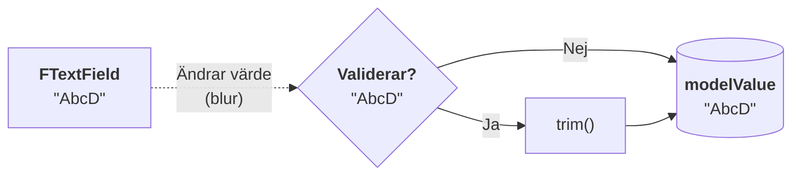
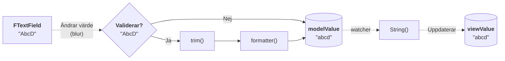
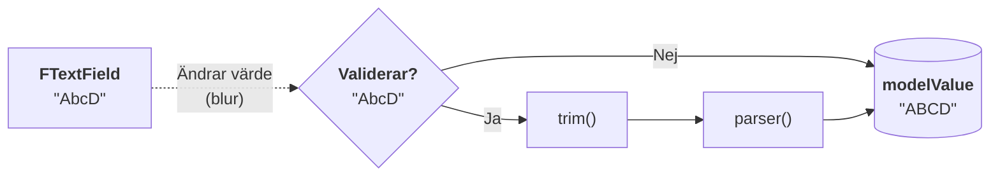
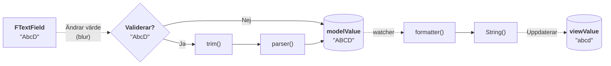
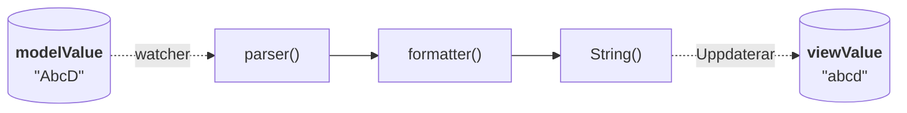

För en djupare förståelse om hur data flödar från inmatningsfält till modell-värde till vy-värde presenterar vi flödesscheman.

## Utan parser och formaterare



## Formaterare utan parser

I detta exempel använder vi en fiktiv formaterare som ändrar skiftläge till gemener.

```ts
function myFormatter(value: string): string {
    return value.toLowerCase();
}
```



```import nomarkup
WithFormatterExample.vue
```

## Parser utan formaterare

I detta exempel använder vi en fiktiv parser som ändrar skiftläge till versaler.

```ts
function myParser(value: string): string {
    return value.toUpperCase();
}
```

```diff
 <f-text-field
+    :parser="myParser"
 ></f-text-field>
```



Eftersom ingen formaterare finns uppdateras inte vy-värdet.

```import nomarkup
WithParserExample.vue
```

## Formaterare och parser

I detta exempel kombinerar vi formateraren och parsern från tidigare flöden.



```import nomarkup
WithParserFormatterExample.vue
```

## Programmatisk uppdatering av model-värde

Vid programmatisk uppdatering av model-värde uppdateras vy-värde automatiskt.
Vy-värdet formateras om en formaterare är angiven.
Om även en parser är angiven utöver formaterare så parsas värdet innan det formateras.
Misslyckas parsning eller formatering på vägen så sätts vy-värdet till model-värdet.



## Relaterat

{@link formatter-parser (Formatering och parsning)}
