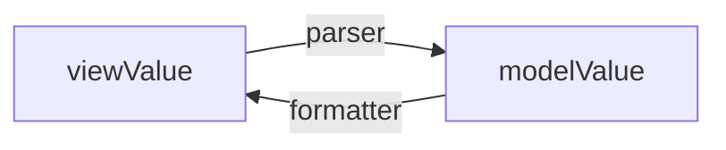

Formatering används för att göra det lättare för användaren att läsa texten i ett inmatningsfält.
Parsning används för att ändra på det som faktiskt hanteras och skickas in.
Till exempel kan formatering lägga till ett mellanslag som tusenavdelare i ett inmatat belopp medan parsning ser till att beloppet hanteras som ett tal och inte som text med ett mellanslag.
Både formatering och parsning görs när användaren lämnar inmatningsfältet och efter att innehållet är validerat och godkänt.

Vi rekommenderar att du i första hand använder de {@link textfield-specialized specialiserade inmatningsfälten} där validering, formatering och parsning är inbyggt.

**Notera att vi stödjer inte formatering och parsning utan validering.**

## Formatering och parsning

Förenklat sett kan man säga att:

- Parser tolkar vy-värdet och gör om till ett modell-värde.
- Formaterare tolkar modell-värdet och gör om till ett vy-värde.

Vy-värdet (`viewValue`) är det som visuellt presenteras i inmatningsfältet och är vanligtvis det som matats in av användaren.

Modell-värdet (`modelValue`) är det värde som skrivs ner till konsumentens `v-model` och följdaktligen det konsumenten får ut från inmatningsfältet.
Modell-värdet är det som senare används av logik och om en parser används är tolkat till rätt datatyp (exempelvis `string` till `number`).



Undantaget från detta är när enbart en formaterare används: då agerar formateraren både som `formatter` och `parser`, det vill säga det formaterade värdet är det som skrivs ner som modell-värde.

### Formatering

Formatering används för göra det lättare för användaren att läsa uppgifter som har matas in.
Formatering görs när användaren lämnar inmatningsfältet och inmatningen har validerats utan fel.
Till exempel formateras siffror inmatade i ett fält för valuta med ett mellanslag som tusenavgränsare och personnummer med ett bindestreck innan de fyra sista siffrorna.
Det värde som visas för användaren är vyvärdet (`viewValue`).

Vy-värdet rensas alltid på inledande och avslutande mellanslag, oavsett om en specifik formaterare är satt eller ej.

För att sätta formaterare använder man `formatter`-propen på {@link FTextField}:

```diff
 <f-text-field
     v-model="myModel"
+    :formatter="formatNumber"
 >
     Inmatningsfält
 </f-text-field>
```

I exemplet nedan visas hur en formaterare (`formatNumber`) används för att infoga tusenavgränsare, notera också att modell-värdet också innehåller det formaterade värdet.

```import nomarkup
FormatterExample.vue
```

{@link custom-formatter-parser (Läs mer om att ta fram applikationsspecifik formaterare.)}

### Parsning

Parsning används för att tolka det inmatade värdet och se till att det blir rätt datatyp och format som kan hanteras av logiken.

Parser får alltid in ett värde med inledande och avslutande mellanslag rensat.

För att sätta parser använder man `parser` propen på {@link FTextField}:

```diff
 <f-text-field
     v-model="myModel"
+    :parser="parseNumber"
 >
     Inmatningsfält
 </f-text-field>
```

I exemplet nedan visas hur en parser (`parseNumber`) används för tolka det inmatade värdet som ett numeriskt värde istället för text.

```import nomarkup
ParserExample.vue
```

{@link custom-formatter-parser (Läs mer om att ta fram en applikationsspecifik parser.)}

### Kombinera formaterare och parser

Det går att kombinera formaterare och parser:

```import nomarkup
CombinedFormatterParserExample.vue
```

Då ser vi hur modellvärdet blir tolkat som ett numeriskt värde och vy-värdet formateras med tusenavgränsare.

## Relaterat

{@link custom-formatter-parser (Formaterare och parser - anpassad)}

{@link textfield-specialized Specialiserade inmatningsfält}
