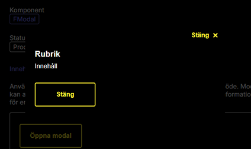

I Windows kan användaren välja ett kontrasttema. Varje tema har en enkel färgpalett med några få färger. Det valda kontrasttemat ersätter alla färger som används i Windows-applikationer och på webbplatser. Syftet är att förenkla användargränssnittet genom att minska antalet färger. Men syftet är också att använda färger som ökar kontrasten mellan bakgrunden och element i förgrunden.

Det här kallas Windows högkontrast eller Windows kontrasttema och aktiverar i sin tur {@link https://developer.mozilla.org/en-US/docs/Web/CSS/Reference/At-rules/@media/forced-colors CSS media-funktionen forced-colors}.

Varken Android, iOS eller MacOS har stöd för kontrastteman. Däremot har flera {@link https://developer.mozilla.org/en-US/docs/Web/CSS/Reference/At-rules/@media/forced-colors#browser_compatibility webbläsare stöd för forced-colors}. I praktiken är det bara Windows i kombination med någon av webbläsarna med stöd för forced-colors som ger användaren möjlighet att själv välja ett kontrasttema.

Här används omväxlande begreppen högkontrast och forced-colors.

## FKDS och högkontrast

I designsystemet försöker vi undvika att designa specifikt för högkontrast, istället ska komponenter i FKDS ha en design som fungerar även i högkontrast. Ibland behöver designers och utvecklare göra val för att designen ska fungera även i högkontrast. Ibland behövs justeringar specifikt för högkontrast. Här tar vi upp några exempel på designval och anpassningar som används i designsystemet.

## Bakgrundsfärger

Alla element får samma bakgrundsfärg när forced-colors är aktivt. Om du använder en avvikande bakgrundsfärg för att skilja ut ett element eller en del av en sida behöver du hitta andra eller kompletterande metoder.

Exempel:

- Du använder en avvikande bakgrundsfärg på en yta med information.
- En knapp med en tydlig bakgrundsfärg används som en Call to Action (CTA).

Resultatet i exemplen ovan blir att varken knappen eller ytan sticker ut visuellt i högkontrastläget.

Fundera på om du kan lyfta fram elementen på något annat sätt än genom att använda en bakgrundsfärg.

- Knappen eller ytan kan kompletteras med en kantlinje (`border` eller `outline`).
- Ytan med viktig information skulle kunna avskiljas från övrigt innehåll med avstånd eller en linje.

Tips: Genom att använda en transparent kantlinje syns den bara i högkontrastläget.

```css
.mydiv {
    border: 2px solid transparent;
}
```

I {@link FModal modalen} används en transparent `outline` för att säkra att modalen syns tydligt mot bakgrunden.

  
Tidigare syntes inte designsystemets modal mot bakgrunden eftersom alla bakgrundsfärger sätts till svart i Windows kontrasttema Natthimmel.

  
Med en transparent outline får modalen en tydlig kantlinje när forcedcolors är aktivt.

## Visuella effekter som feedback till användaren

### Muspekaren förs över ett element

I FKDS ändras ofta en komponents bakgrundsfärg för att visa användaren att muspekaren förs över ett interaktivt element.

Exempel:

- Rad i en utfälld kombobox
- Dag i en kalender

Den här typen av visuell effekt försvinner i högkontrast eftersom alla element får samma bakgrundsfärg.

I dessa fall använder komponenter i FKDS en media-query för att sätta elements kantlinje (border eller outline) till {@link https://developer.mozilla.org/en-US/docs/Web/CSS/Reference/Values/system-color systemfärgen} highlight.

  
Hover-effekt för en dag i kalendern i Windows kontrasttema Natthimmel.

```css
.calendar-day:hover {
    @media (forced-colors: active) {
        border: 2px solid highlight;
    }
}
```

Ibland kan det vara bra att hitta andra sätt att än att ändra bakgrundsfärgen när du vill ge användaren tydlig återkoppling. I FKDS ändras till exempel tjockleken på länkars understrykning när användaren för muspekaren över dem. En design som fungerar även i högkontrast, utan justeringar.

```html
<a class="anchor anchor--block" href="javascript:">En länk </a>
```

### Visa ett element som valt

Valbara element markeras ofta som valda genom att bakgrundsfärgen ändras.

Exempel i FKDS

- Rad i en utfälld kombobox
- Dag i kalendern
- Checkbox

I dessa fall sätts komponents bakgrundsfärg till systemfärgen `highlight` när forced-colors är aktivt. Eventuell text som visas i förgrunden får systemfärgen `highlightText`.

När en bakgrund färgläggs med en systemfärg lägger webbläsare till en bakgrund bakom texten för att säkra tillräcklig kontrast. Genom att använda {@link https://developer.mozilla.org/en-US/docs/Web/CSS/Reference/Properties/forced-color-adjust forced-color-adjust: none} kan du ta full kontroll över presentationen i högkontrastläget.

  
De tre exemplen visar ett valt alternativ i komboboxens lista där bakgrundsfärgen är satt till `highlight`. I första exemmplet är textens färg oförändrad. I andra exemplet är textfärgen `highlightText`. I både första och andra exemplet har browsern lagt en svart bakgrund bakom texten. I tredje exemplet används `highlightText` och `forced-color-adjust: none`.

```css
.combobox__listbox__option--highlight {
    @media (forced-colors: active) {
        background-color: highlight;
        color: highlightText;
        forced-color-adjust: none;
    }
}
```

Var noggrann med när du använder forced-color-adjust, det kan ge oförutsedda effekter.

## SVG-filer och färger

SVG-filer behåller sina färger när forced-colors är aktivt. Det gäller både SVG-filer som färgsätts i SVG-filen i sig eller via CSS.

I FKDS komponenter används ikoner i SVG-format som komplement till text. Till exempel kan en knapp för att radera ha en text samt en ikon i form av en soptunna. Ikonerna är alltid enkla och består oftast bara av en färg, samma som intilliggande text.

Ikoner i designsystemet har oftast ingen egen färg. Istället pekar SVG-filerna på {@link https://developer.mozilla.org/en-US/docs/Web/CSS/Reference/Values/color_value#currentcolor_keyword currentColor}. Därmed kommer ikonen att följa textfärgen i den kontext där ikonen används. Till exempel kommer en ikon som används i en knapp alltid att följa knappens textfärg, även när forced-colors är aktivt.

I de fall en ikon används som en knapp utan någon relaterad text sätts ikonen till systemfärgen `buttonBorder`.

```css
.buttonicon {
    @media (forced-colors: active) {
        color: buttonBorder;
    }
}
```

## Kantlinjer

Undvik att skapa linjer med en `<div>` som färgsätts med en bakgrundsfärg.
Försök använda en border istället. Om du måste används en `<div>` med en bakgrundsfärg behöver du sätta en färg med media-query forced-colors.

Exempel i FKDS:
Kantlinjen till en {@link FResizePane Justerbar yta} använder systemfärgen `canvasText` som bakgrundsfärg på en `<div>` som används som en avdelande linje.
