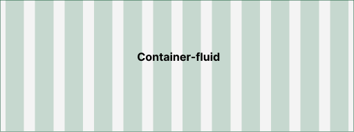
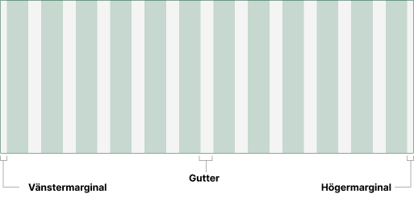
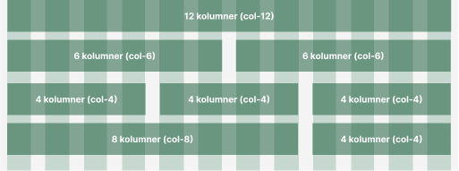

<!-- [html-validate-disable-next element-permitted-content -- css for grid component example] -->
<style>
    .container-fluid {
        background: repeating-linear-gradient( 90deg, #f4f4f4, #f4f4f4 1rem, rgba(17, 106, 62, 0.10) 1rem, rgba(17, 106, 62, 0.10) calc(8.33% - 1rem), #f4f4f4  calc(8.33% - 1rem), #f4f4f4 calc(8.33% ));
    }
 .example-grid {
      text-align: center;

    .example-content {
      background-color: #88B49F;
      margin-bottom: 1.5rem;
          }
}
</style>

Grid används för att skapa responsiva gränssnitt som anpassar sig till olika skärm- och fönsterstorlekar. Det definierar den yta som komponenter kan placeras på och styr hur stor del av ytans bredd som komponenterna får uppta vid olika brytpunkter för skärmbredden.

## Containers

Containern styr den maximala bredden som innehållet får ta och sätter marginal i vänster- och högerkant. Containerns fulla bredd motsvarar 12 kolumner.
Det finns två typer av containers:

-   **Container** – centrerar innehållet på skärmen i en maxbredd som varierar beroende av skärmens bredd


-   **Container-fluid** - tar 100% av den tillgängliga ytan. Om en maxbredd sätts kommer ytan vänsterjusteras



## Marginaler och mellanrum

Containers har inbyggda marginaler motsvarande 1 rem till höger och vänster. Gutter är mellanrummet mellan kolumnerna och motsvarar 2 rem.



## Rader och kolumner

Innehåll i ett gridlayout placeras i kolumner (`col`) och kolumnerna ska i sig alltid ligga i en rad (`row`). Varje rad har 12 möjliga kolumner, vilket motsvarar hela bredden som raden placeras i. Bredden på en kolumn anges i hur många av radens 12 möjliga kolumner som den får uppta. Komponenter som placeras i kolumnen tar sedan hela kolumnens bredd.

### Exempel kolumner

```html static
<div class="row">
    <div class="col col--md-6">...</div>
    <div class="col col--md-6">...</div>
</div>
```



-   En kolumn som sätts till col-12 tar upp alla 12 möjliga kolumner i raden, men eftersom samma resultat uppnås utan att använda rad- och kolumnklasser behöver den varianten i regel inte användas.
-   I en rad med två lika stora kolumner får vardera ta upp 6 av radens 12 möjliga kolumner.
-   I en rad med tre lika stora kolumner får vardera ta upp 4 av radens 12 möjliga kolumner.
-   Kolumnerna i en rad kan vara olika stora – så länge summan av kolumnernas bredd inte överstiger 12 kommer de lägga sig bredvid varandra.

#### Exempel med olika komponentstorlekar

Komponenternas bredd styrs av bredden på den kolumn de placeras i.

```html nomarkup borderless
<div class="container-fluid">
    <div class="row">
        <div class="col col--md-9">
            <div class="text-field">
                <div class="i-width-sm-12">
                    <label class="label" for="fkui-vue-element-0001">
                        Stor (col--md-9)
                    </label>
                </div>
                <div class="text-field__input-wrapper i-width-sm-12">
                    <div class="text-field__icon-wrapper">
                        <input
                            id="fkui-vue-element-0001"
                            type="text"
                            class="text-field__input"
                        />
                    </div>
                </div>
            </div>
        </div>
    </div>
    <div class="row row--align-bottom">
        <div class="col col--md-3">
            <div class="text-field">
                <div class="i-width-sm-12">
                    <label class="label" for="fkui-vue-element-0002">
                        Liten (col--md-3)
                    </label>
                </div>
                <div class="text-field__input-wrapper i-width-sm-12">
                    <div class="text-field__icon-wrapper">
                        <input
                            id="fkui-vue-element-0002"
                            type="text"
                            class="text-field__input"
                        />
                    </div>
                </div>
            </div>
        </div>
        <div class="col col--md-6">
            <div class="text-field">
                <div class="i-width-sm-12">
                    <label class="label" for="fkui-vue-element-0003">
                        Medium (col--md-6)
                    </label>
                </div>
                <div class="text-field__input-wrapper i-width-sm-12">
                    <div class="text-field__icon-wrapper">
                        <input
                            id="fkui-vue-element-0003"
                            type="text"
                            class="text-field__input"
                        />
                    </div>
                </div>
            </div>
        </div>
    </div>
    <div class="row">
        <div class="col col--md-3 col--lg-3">
            <div class="text-field">
                <div class="i-width-md-12">
                    <label class="label" for="fkui-vue-element-0004">
                        Liten
                    </label>
                </div>
                <div class="text-field__input-wrapper i-width-sm-12">
                    <div class="text-field__icon-wrapper">
                        <input
                            id="fkui-vue-element-0004"
                            type="text"
                            class="text-field__input"
                        />
                    </div>
                </div>
            </div>
        </div>
    </div>
</div>
```

## Brytpunkter

Genom att använda fördefinierade brytpunkter kan du anpassa hur en layout ska se ut vid olika skärmstorlekar. Det finns fyra brytpunkter som kan konfigureras. Varje brytpunkt har ett standardvärde för vilken skärmbredd den kommer att bryta på:

-   sm - skärmbredd mellan 0 och 639 pixlar
-   md - skärmbredd mellan 640 och 1023 pixlar
-   lg - skärmbredd mellan 1024 och 1279 pixlar
-   xl - skärmbredd från 1280 pixlar och uppåt

Du sätter bredden på en kolumn för olika skärmstorlekar genom att ange i klassen för vilken brytpunkt bredden gäller.

### Storlek på kolumner i olika scenarion

För att aktivera de olika brytpunkterna så kan du minska bredden på webbläsarens fönster.

I de angivna exempel nedan finns det två olika scenarion. Ett där föräldern tar upp hela bredden på 12 kolumner och ett exempel där föräldern tar 8 kolumner medan dess barn tar hela bredden på 12 kolumner inuti dess förälder.

#### Förälder med 12 kolumner

```html
<div class="container-fluid">
    <div class="row example-grid">
        <div class="col col--md-6">
            <div class="example-content">col--md-6</div>
        </div>
        <div class="col col--md-6">
            <div class="example-content">col--md-6</div>
        </div>
    </div>
    <div class="row example-grid">
        <div class="col col--md-3">
            <div class="example-content">col--md-3</div>
        </div>
        <div class="col col--md-3">
            <div class="example-content">col--md-3</div>
        </div>
        <div class="col col--md-3">
            <div class="example-content">col--md-3</div>
        </div>
        <div class="col col--md-3">
            <div class="example-content">col--md-3</div>
        </div>
    </div>
    <div class="row example-grid">
        <div class="col col--sm-4">
            <div class="example-content">col--sm-4</div>
        </div>
        <div class="col col--sm-8">
            <div class="example-content">col--sm-8</div>
        </div>
    </div>
    <div class="row example-grid">
        <div class="col col--lg-4">
            <div class="example-content">col--lg-4</div>
        </div>
        <div class="col col--lg-8">
            <div class="example-content">col--lg-8</div>
        </div>
    </div>
</div>
```

#### Förälder med 8 kolumner

I detta exempel nästlar vi en grid i en förälder med 8 kolumner.
Det innebär att kolumernas storlek kommer motsvara tolftedelar utav förälderns 8 kolumner och inte längre skärmstorleken.

```html static
<div class="row">
    <div class="col col--md-8">
        <div class="row">
            <!-- [nästlade kolumner] -->
        </div>
    </div>
</div>
```

```html nomarkup
<div class="container-fluid">
    <div class="row example-grid">
        <div class="col col--md-8">
            <div class="row">
                <div class="col col--md-6">
                    <div class="example-content">col--md-6</div>
                </div>
                <div class="col col--md-6">
                    <div class="example-content">col--md-6</div>
                </div>
            </div>
            <div class="row">
                <div class="col col--md-3">
                    <div class="example-content">col--md-3</div>
                </div>
                <div class="col col--md-3">
                    <div class="example-content">col--md-3</div>
                </div>
                <div class="col col--md-3">
                    <div class="example-content">col--md-3</div>
                </div>
                <div class="col col--md-3">
                    <div class="example-content">col--md-3</div>
                </div>
            </div>
        </div>
    </div>
</div>
```

## Placering

Grid stödjer dynamisk placering av kolumner både horisontellt och vertikalt.

### Horisontellt

```html
<div class="container-fluid">
    <div class="row example-grid">
        <div class="col col--sm-4">
            <div class="example-content">Till</div>
        </div>
        <div class="col col--sm-4">
            <div class="example-content">Vänster</div>
        </div>
    </div>
    <div class="row example-grid row--align-end">
        <div class="col col--sm-4">
            <div class="example-content">Till</div>
        </div>
        <div class="col col--sm-4">
            <div class="example-content">Höger</div>
        </div>
    </div>
    <div class="row example-grid row--align-center">
        <div class="col col--sm-4">
            <div class="example-content">I</div>
        </div>
        <div class="col col--sm-4">
            <div class="example-content">Mitten</div>
        </div>
    </div>
    <div class="row example-grid row--align-justify">
        <div class="col col--sm-4">
            <div class="example-content">I</div>
        </div>
        <div class="col col--sm-4">
            <div class="example-content">Kanterna</div>
        </div>
    </div>
    <div class="row example-grid row--align-spaced">
        <div class="col col--sm-4">
            <div class="example-content">Luft</div>
        </div>
        <div class="col col--sm-4">
            <div class="example-content">Luft</div>
        </div>
    </div>
</div>
```

### Vertikalt

```html
<div class="container-fluid">
    <div class="row example-grid row--align-top">
        <div class="col col--sm-4">
            <div class="example-content">Lite text</div>
        </div>
        <div class="col col--sm-4">
            <div class="example-content">
                Massa text. Massa text. Massa text. Massa text. Massa text.
                Massa text. Massa text. Massa text. Massa text. Massa text.
                Massa text.
            </div>
        </div>
    </div>
    <div class="row example-grid row--align-middle">
        <div class="col col--sm-4">
            <div class="example-content">Lite text</div>
        </div>
        <div class="col col--sm-4">
            <div class="example-content">
                Massa text. Massa text. Massa text. Massa text. Massa text.
                Massa text. Massa text. Massa text. Massa text. Massa text.
                Massa text.
            </div>
        </div>
    </div>
    <div class="row example-grid row--align-bottom">
        <div class="col col--sm-4">
            <div class="example-content">Lite text</div>
        </div>
        <div class="col col--sm-4">
            <div class="example-content">
                Massa text. Massa text. Massa text. Massa text. Massa text.
                Massa text. Massa text. Massa text. Massa text. Massa text.
                Massa text.
            </div>
        </div>
    </div>
</div>
```

#### Vertikal placering av kolumner

```html
<div class="container-fluid">
    <div class="row example-grid ">
        <div class="col col--md-3">
            <div class="example-content">
                Massa text. Massa text. Massa text. Massa text. Massa text.
                Massa text. Massa text. Massa text. Massa text. Massa text.
                Massa text.
            </div>
        </div>
        <div class="col col--md-3 col--align-top">
            <div class="example-content">Lite text</div>
        </div>
        <div class="col col--md-3 col--align-bottom">
            <div class="example-content">Lite text</div>
        </div>
        <div class="col col--md-3 col--align-middle">
            <div class="example-content">Lite text</div>
        </div>
    </div>
</div>
```

### Ordning av kolumner

Tänk på att om du via styling ändrar ordning på kolumner så kommer det inte påverka hur de läses upp av skärmläsare.

#### Hjälpklasser för dynamisk ordning

Grid inkluderar flera hjälpklasser för dynamisk ordning, `col--order-$ORDNING` och `col--$BRYTPUNKT-order-$ORDNING` så att det är lättare att byta ordning på kolumner dynamiskt mellan olika brytpunkter.

```html
<div class="container-fluid">
    <div class="row example-grid">
        <div class="col col--md-6 col--order-2">
            <div class="example-content">1</div>
        </div>
        <div class="col col--md-6 col--order-1">
            <div class="example-content">2</div>
        </div>
    </div>
</div>
```
