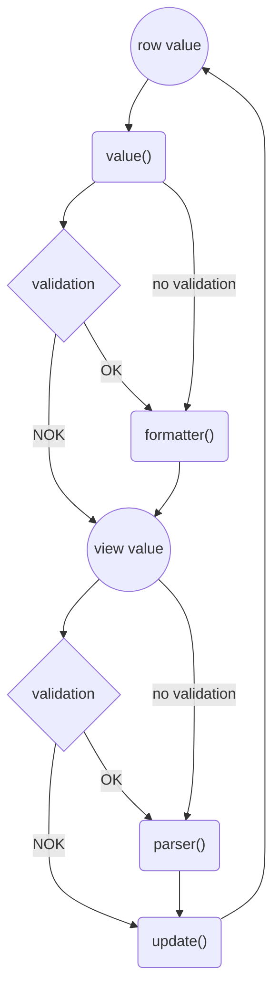
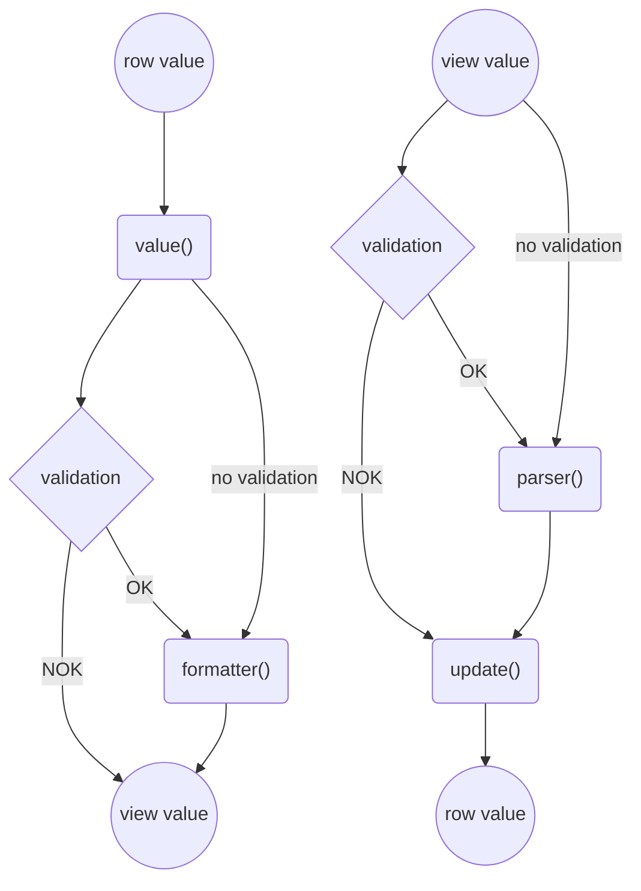

Kolumntypen `text` används för att visa text i `FTable`, texten går att anpassa med egen formaterare, parser och validator.

Tabellens kolumner och dess egenskaper defineras med hjälp av hjälpfunktionen `defineTableColumns`.

```ts name=column-base
interface Row {
    value: string;
}

const rows = ref<Row[]>([
    {
        value: "It´s a string",
    },
]);

const columns = defineTableColumns<Row>([
    {
        type: "text",
        header: "Kolumnrubrik",
        key: "value",
    },
]);
```

Nedan visas ett komplett exempel tillsammans med `FTable`.

```import
FTableText.vue
```

## Value

Texten som ska visas kan manipuleras med hjälp av callbackfunktionen `value(row: T): string`. Parametern `row` innehåller det aktuella rad-objektet.

```ts compare=column-base
interface Row {
    value: string;
}

const rows = ref<Row[]>([
    {
        value: "It´s a string",
    },
]);

const columns = defineTableColumns<Row>([
    {
        type: "text",
        header: "Kolumnrubrik",
        value(row): string {
            const newValue = row.value;
            /* do stuff with newValue */
            return newValue;
        },
    },
]);
```

I exemplet nedan visas hur man med hjälp av `value()` kan slå samman två värden för att visa i en egen kolumn.

```import
FTableTextValue.vue
```

## Formaterare

Om innehållet i rad-objektet behöver formateras innan det visas i tabellen så används callbackfunktionen `formatter(value: string): string`.
Inparametern `value` är värdet från rad-objektet vars prop matchar värdet i kolumndefinitionens `key`.
Om formateraren kombineras med callbackfunktionen `value()` så anropas den med resultatet från `value()` som inparameter.
Om formateraren kombineras med validering så krävs en lyckad validering för att formatteraren ska anropas.

```ts compare=column-base
interface Row {
    value: string;
}

const rows = ref<Row[]>([
    {
        value: "It´s a string",
    },
]);

const columns = defineTableColumns<Row>([
    {
        type: "text",
        header: "Kolumnrubrik",
        key: "value",
        formatter(value: string): string {
            const newValue = value;
            /* do stuff with newValue */
            return newValue;
        },
    },
]);
```

Exemplet nedan visar hur formateraren gör om texten till gemener.

```import
FTableTextFormatter.vue
```

## Parsning

Om cellen är redigerbar så kan datan manipuleras innan den skrivs ned i rad-objeket, det görs med hälp av callbackfunktionen `parser(value: string): string | undefined`.
Parsern anropas med cellens värde då editeringen avslutas.
Om parsern kombineras med validering så krävs en lyckad validering för att parsern ska anropas.

```ts compare=column-base
interface Row {
    value: string;
}

const rows = ref<Row[]>([
    {
        value: "It´s a string",
    },
]);

const columns = defineTableColumns<Row>([
    {
        type: "text",
        header: "Kolumnrubrik",
        key: "value",
        editable: true,
        parser(value: string): string {
            const newValue = value;
            /* do stuff with newValue */
            return newValue;
        },
    },
]);
```

Nedan visas ett exempel där inmatad text görs om till gemener då editering av celll avslutas.
Notera att parsen inte anropas förens editeringen avslutas, därav så innehåller rad-objektet versaler ända tills cellen har redigerats.

```import
FTableTextParser.vue
```

## Update

Som en sista möjlighet att påverka vad som skrivs ner i rad-objektet så kan callbackfunktionen `update(row: T, newValue: string, oldValue: string): void` användas.
`update()` anropas efter eventuell parser och har tillgång till det aktuella rad-objektet `row`.
Det nya värdet `newValue`, om pareser används så är detta det parsade värdet, samt det gamla värdet `oldValue`.

```ts compare=column-base
interface Row {
    value: string;
}

const rows = ref<Row[]>([
    {
        value: "It´s a string",
    },
]);

const columns = defineTableColumns<Row>([
    {
        type: "text",
        header: "Kolumnrubrik",
        key: "value",
        editable: true,
        update(row: T, newValue: string, oldValue: string): void {
            /* do stuff */
            row.value = "Some new value";
        },
    },
]);
```

Exemplet nedan visar hur värdet i rad-objektet bara uppdateras om det nya värdet börjar på bokstaven a.

```import
FTableTextUpdate.vue
```

## Validering

Redigerbara celler kan valideras med hjälp av "@link validators validatorer", det görs genom parameten `validation: ValidatorConfigs`.

```ts compare=column-base
interface Row {
    value: string;
}

const rows = ref<Row[]>([
    {
        value: "It´s a string",
    },
]);

const columns = defineTableColumns<Row>([
    {
        type: "text",
        header: "Kolumnrubrik",
        key: "value",
        editable: true,
        validation: {
            minLength: { length: 2 },
            maxLength: { length: 3 },
        },
    },
]);
```

Alternativt så använder man sig av någon av de färdiga subtyperna, som motsvarar de "@link textfield-specialized specialiserade inmatningsfälten":

- {@link text-bank-account-number text:bankAccountNumber}
- text:bankgiro
- text:clearingNumber
- text:currency
- text:date
- text:email
- text:number
- text:organisationsnummer
- text:percent
- text:personnummer
- text:phoneNumber
- text:plusgiro
- text:postalCode

Nedan visas ett exempel där texten i cellen valideras mot både en min-längd och en max-längd.

```import
FTableTextValidation.vue
```

## Flödesdiagram



Alternativ layout:



## Parametrar

**`align:`** `"left" | "right"` {@optional}
: Höger eller vänsterställd text och kolumnrubrik.
Default `left`.

**`description:`** `string | Readonly<Ref<string | null>>` {@optional}
: Formatbeskrivning

**`editable:`** `boolean | ((row: T) => boolean)  => {}` {@optional}
: Om cellen är redigerbar.
Default `false`.

**`formatter:`** `(value: string): string | undefined  => {}` {@optional}
: Funktion som används för att formatera värdet som visas. Parametern `value` är värdet från funktionen `value()` nedan.
Anropas ej vid misslyckad validering.

**`header:`** `string | Readonly<Ref<string>>`
: Kolumnrubrik som visas i thead.

**`key:`** `K` {@optional}
: Kopplar cellens värde till värde i `T`.

**`label:`** `(row: T): string  => {}` {@optional}
: Etikett kopplad till cellen för skärmläsare, ej synlig.

**`parser:`** `(value: string): string | undefined  => {}` {@optional}
: Funktion som parsar värdet innan `update()` anropas. Anropas ej vid misslyckad validering.

**`size:`** `TableColumnSize | Readonly<Ref<TableColumnSize | null>>` {@optional}
: Hur kolumnens bredd skalas. `"grow"` ger största möjliga bredd och `"shrink"` minsta möjliga bredd.
Default: `grow`.

**`tnum:`** `boolean` {@optional}
: Tabular figures, till exempel att tal 111 ta samma plats som 000.

**`type:`** `InputTypeText`
: Kolumnens typ, sätts till `text`.

**`update:`** `(row: T, newValue: string, oldValue: string): void  => {}` {@optional}
: Funktion som uppdater det parsade värdet från `parse()` innan det uppdateras i rad-objektet `T`.

**`validation:`** `ValidatorConfigs` {@optional}
: Konfiguration för validering, till exempel `{ minLength: { length: 2 }, maxLength: { length: 3 }}`. Se [ValidatorConfigs](../../../logic/types/ValidatorConfigs.html)

**`value`:** `(row: T): string => {}` {@optional}
: Anropas vid läsning av värde från `T`. Ger möjlighet att manipulera värdet innan till exempel formattering.
